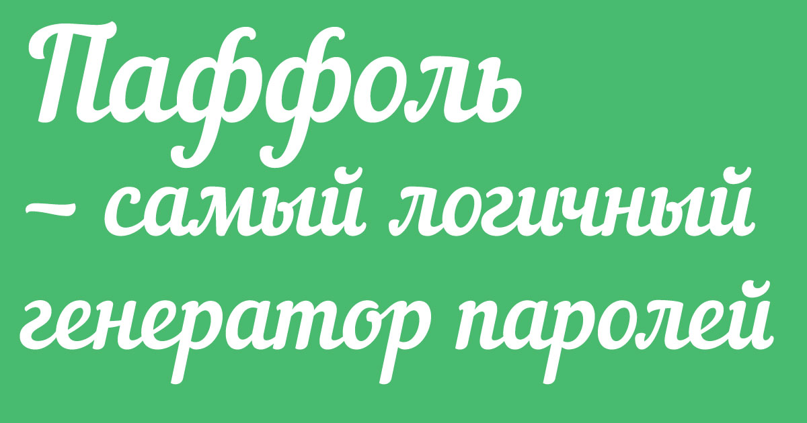

## О проекте

Идея пришла одним вечером после того, как мне в очередной раз пришлось помогать с придумыванием пароля. После этого я подумал, может, я не один такой? И начал его реализовывать и реализовал :)

Изначально проект был реализован на [Ruby on Rails](http://rubyonrails.org/), и год спустя решил переписать его на [Go](https://golang.org/).

## For the curious

This is a service to generate password from phrase in Russian language.

## Contribution

[RU] Все кто хотят, могут принимать участие в улучшении :)

[EN] Everyone can contribute, to make service better :)
